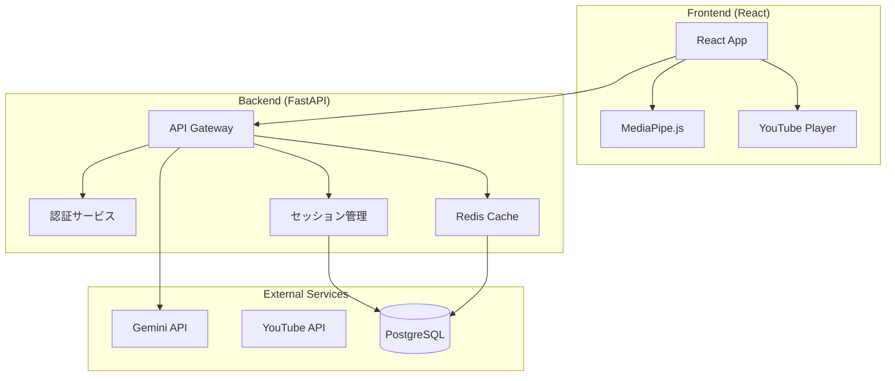

# 🕺 Dance Motion Analyzer - エンタープライズグレード ダンス学習プラットフォーム

## 📌 プロジェクト概要

Dance Motion Analyzerは、AI Studioで生成されたMVPをベースに、エンタープライズグレードのダンス学習プラットフォームへと進化させたプロジェクトです。

### 🚀 開発フェーズ

#### Phase 1: MVP + Backend基盤 (完了) ✅
- AI Studioによる自動生成
- クライアントサイド完結
- Gemini API直接統合
- **バックエンドAPI実装完了** 🆕
- **データベースモデル構築完了** 🆕
- **認証システム実装完了** 🆕
- **0-100点評価システム改善** 🆕

#### Phase 2: Production Ready (現在) 🔄
- Redisキャッシング実装
- Celery非同期処理
- パフォーマンス最適化

#### Phase 3: Enterprise (計画中) 📋
- マルチテナント対応
- 分析ダッシュボード
- ML最適化

## 🏗 アーキテクチャ

### 現在のアーキテクチャ（MVP → Production）



## 📁 プロジェクト構造

```
dance-motion-analyzer/
├── frontend/                 # React + TypeScript (MVPベース)
│   ├── src/
│   │   ├── components/      # UIコンポーネント
│   │   ├── services/        # API通信
│   │   └── App.tsx          # メインアプリケーション
│   └── package.json
│
├── backend/                  # FastAPI (新規実装)
│   ├── app/
│   │   ├── api/            # APIエンドポイント
│   │   ├── core/           # 設定・セキュリティ
│   │   ├── models/         # データモデル
│   │   └── services/       # ビジネスロジック
│   └── requirements.txt
│
├── docs/                     # ドキュメント
│   ├── technical/          # 技術仕様
│   ├── guides/             # 開発ガイド
│   └── api/                # API仕様
│
└── deploy/                  # デプロイメント設定
    ├── docker/
    ├── kubernetes/
    └── terraform/
```

## 🚀 クイックスタート

### 1. 環境変数の設定

```bash
# フロントエンドの環境変数をセットアップ
cp frontend/.env.example frontend/.env.local
# frontend/.env.localを編集してAPIキーを設定

# バックエンドの環境変数をセットアップ（必要な場合）
cp backend/.env.example backend/.env
# backend/.envを編集してAPIキーを設定
```

> ⚠️ **重要**: 実際のAPIキーは絶対にGitにコミットしないでください

### 2. フロントエンド（既存MVP）

```bash
cd frontend
npm install
npm run dev
```

### 3. バックエンド（新規）

```bash
cd backend
python -m venv venv
source venv/bin/activate  # Windows: venv\Scripts\activate
pip install -r requirements.txt
uvicorn app.main:app --reload
```

### 4. Docker Compose（オプション）

```bash
# ルートディレクトリで環境変数を設定
cp .env.template .env
# .envを編集してAPIキーとパスワードを設定

# 全サービスを起動
docker-compose up
```

## 💡 なぜバックエンドが必要か

### MVPの制限
1. **セキュリティ**: APIキーがクライアント側に露出
2. **スケーラビリティ**: 各クライアントが直接Gemini APIを呼び出し
3. **データ永続性**: セッション履歴が保存されない
4. **分析機能**: 集計・分析が不可能

### バックエンド実装のメリット
1. **APIキー保護**: サーバー側で安全に管理
2. **レート制限**: 適切なスロットリング
3. **キャッシング**: 同じ動画の分析結果を再利用
4. **ユーザー管理**: 認証・認可・履歴管理
5. **分析機能**: ダッシュボード・レポート生成

## 🛠 技術スタック

### フロントエンド（MVP継承）
- **Framework**: React 18 + TypeScript
- **UI**: Tailwind CSS
- **姿勢推定**: MediaPipe.js
- **動画**: react-youtube
- **ビルド**: Vite

### バックエンド（新規）
- **Framework**: FastAPI
- **認証**: JWT + OAuth2
- **DB**: PostgreSQL + SQLAlchemy
- **キャッシュ**: Redis
- **タスクキュー**: Celery
- **AI**: Gemini API (サーバー側)

### インフラ
- **コンテナ**: Docker
- **オーケストレーション**: Kubernetes
- **CI/CD**: GitHub Actions
- **モニタリング**: Prometheus + Grafana

## 📊 開発ロードマップ

### Q1 2025（現在）
- [x] MVP完成（AI Studio）
- [x] フロントエンド最適化
- [ ] バックエンドAPI実装
- [ ] 認証システム実装

### Q2 2025
- [ ] データベース設計
- [ ] キャッシング実装
- [ ] ダッシュボード開発
- [ ] パフォーマンス最適化

### Q3 2025
- [ ] マルチテナント対応
- [ ] カスタムMLモデル
- [ ] モバイルアプリ
- [ ] 国際化対応

## 🔑 主要機能

### 現在（MVP）
- ✅ YouTube URL入力でダンス分析
- ✅ リアルタイム姿勢推定
- ✅ Gemini AIフィードバック
- ✅ シンクロ率スコア表示

### 実装予定
- 🔄 ユーザー認証・管理
- 🔄 練習履歴の保存
- 🔄 プログレストラッキング
- 🔄 ソーシャル共有機能
- 📋 カスタムプレイリスト
- 📋 チャレンジモード
- 📋 リーダーボード

## 🚀 デプロイメント

### 開発環境
```bash
docker-compose up
```

### ステージング
```bash
kubectl apply -f deploy/kubernetes/staging/
```

### 本番環境
```bash
terraform apply -var-file="production.tfvars"
```

## 📝 API仕様（バックエンド）

### 認証
```http
POST /api/v1/auth/login
POST /api/v1/auth/refresh
POST /api/v1/auth/logout
```

### 分析
```http
POST /api/v1/analysis/start
GET  /api/v1/analysis/{session_id}
POST /api/v1/analysis/feedback
```

### ユーザー
```http
GET  /api/v1/users/me
PUT  /api/v1/users/me
GET  /api/v1/users/me/history
```

## 🔒 セキュリティ

- JWT認証
- Rate Limiting
- CORS設定
- SQLインジェクション対策
- XSS対策
- HTTPS必須

## 🧪 テスト

```bash
# フロントエンドテスト
cd frontend && npm test

# バックエンドテスト
cd backend && pytest

# E2Eテスト
npm run test:e2e
```

## 📈 パフォーマンス目標

| メトリクス | MVP | Production | Enterprise |
|-----------|-----|------------|------------|
| レスポンスタイム | <2s | <500ms | <200ms |
| 同時接続数 | 100 | 1,000 | 10,000 |
| 可用性 | 95% | 99.5% | 99.9% |
| APIコール/月 | 10K | 100K | 1M |

## 🤝 コントリビューション

1. Issueを作成
2. Feature branchを作成
3. コードを実装
4. テストを追加
5. PRを作成

## 📄 ライセンス

MIT License

## 🔗 リンク

- [フロントエンドデモ](https://dance-analyzer-frontend.vercel.app)
- [API ドキュメント](https://api.dance-analyzer.com/docs)
- [開発者ポータル](https://dev.dance-analyzer.com)

---

**Built with ❤️ using AI Studio MVP + Enterprise Architecture**

*From MVP to Production-Ready Platform*
