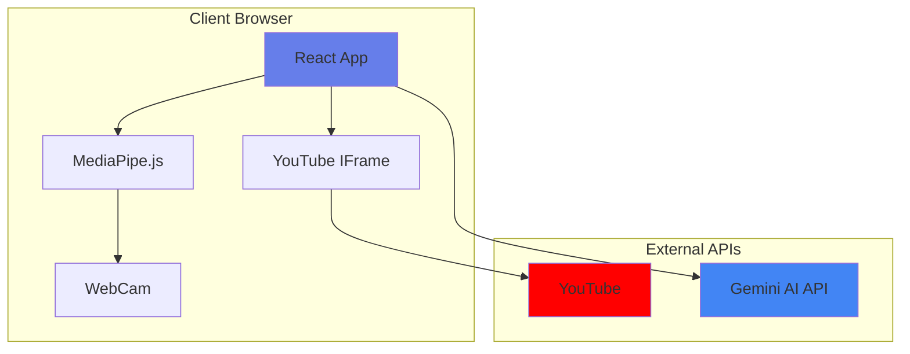
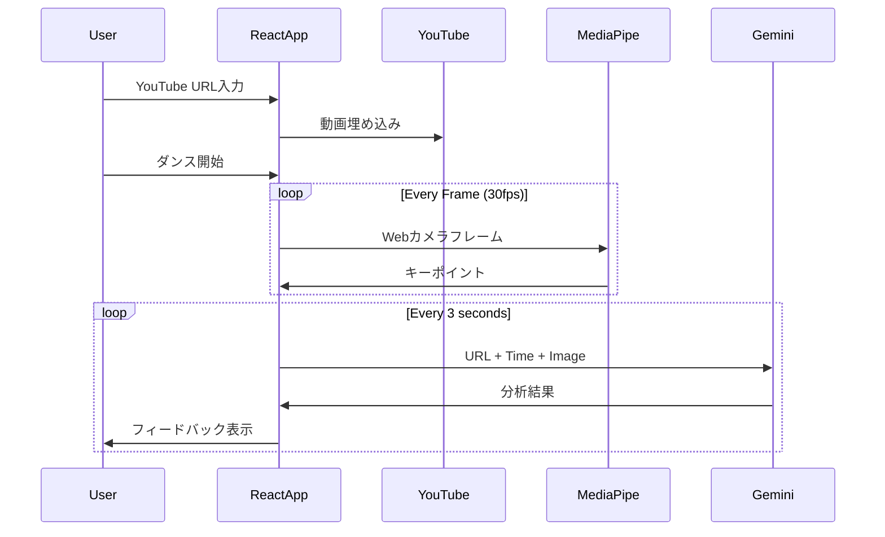

# システムアーキテクチャ - Gemini-First Design

## 1. アーキテクチャ概要

Dance Motion Analyzerは、**Gemini APIを中心とした革新的なサーバーレスアーキテクチャ**を採用。従来の複雑な分散システムを、シンプルなクライアントサイドアプリケーションに変革しました。

## 2. 革新的アーキテクチャ図

### 2.1 シンプル化されたシステム構成



### 2.2 従来アーキテクチャとの比較

#### ❌ 従来の複雑なアーキテクチャ
```
15個のコンポーネント:
LoadBalancer → WebServer → AppServer → WebSocket Server →
Cache → Queue → Worker → MediaPipe Server → ML Server →
Storage → CDN → Database → Monitoring → Logging → Backup
```

#### ✅ Gemini-Firstのシンプルアーキテクチャ
```
3個のコンポーネント:
React App → YouTube API
         → Gemini API
```

## 3. コンポーネント詳細

### 3.1 クライアントサイド（すべてがここで完結）

```typescript
// アプリケーション全体の構造
interface AppArchitecture {
  ui: {
    framework: "React 18",
    styling: "Tailwind CSS",
    state: "React Hooks"
  },
  videoPlayback: {
    api: "YouTube IFrame API",
    control: "Play/Pause/Speed",
    timestamp: "Real-time tracking"
  },
  poseDetection: {
    library: "MediaPipe.js",
    model: "Pose Landmark Model",
    fps: 30,
    keypoints: 33
  },
  aiCoaching: {
    api: "Gemini API",
    model: "gemini-1.5-flash",
    multimodal: true
  }
}
```

### 3.2 データフロー



## 4. Gemini API統合アーキテクチャ

### 4.1 API呼び出しパターン

```typescript
class GeminiArchitecture {
  // シングルトンパターンでAPI管理
  private static instance: GeminiArchitecture;
  private geminiClient: GoogleGenerativeAI;
  private requestQueue: AnalysisRequest[] = [];
  private processing = false;
  
  private constructor(apiKey: string) {
    this.geminiClient = new GoogleGenerativeAI(apiKey);
    this.startQueueProcessor();
  }
  
  static getInstance(apiKey: string): GeminiArchitecture {
    if (!this.instance) {
      this.instance = new GeminiArchitecture(apiKey);
    }
    return this.instance;
  }
  
  // リクエストキューイング（レート制限対策）
  async analyzeMovement(request: AnalysisRequest): Promise<AnalysisResult> {
    return new Promise((resolve) => {
      this.requestQueue.push({ ...request, callback: resolve });
    });
  }
  
  // バッチ処理で効率化
  private async startQueueProcessor() {
    setInterval(async () => {
      if (this.requestQueue.length > 0 && !this.processing) {
        this.processing = true;
        const request = this.requestQueue.shift();
        
        try {
          const result = await this.processRequest(request);
          request.callback(result);
        } catch (error) {
          request.callback({ error: error.message });
        }
        
        this.processing = false;
      }
    }, 3000); // 3秒間隔でレート制限回避
  }
}
```

### 4.2 マルチモーダル処理

```javascript
// Geminiへの入力構造
const geminiInput = {
  // テキストプロンプト
  text: {
    youtube_url: "https://youtube.com/watch?v=xxx",
    timestamp: 15.5,
    instruction: "動きを比較して日本語でアドバイス"
  },
  
  // 画像データ
  image: {
    data: base64EncodedWebcamFrame,
    mimeType: "image/jpeg"
  },
  
  // オプション: 姿勢データ
  metadata: {
    keypoints: mediaPipeKeypoints,
    confidence: 0.95
  }
};

// Geminiからの出力構造
const geminiOutput = {
  analysis: {
    score: 85,
    timing: "excellent",
    posture: "good",
    expression: "needs_improvement"
  },
  feedback: {
    positive: "リズム感が素晴らしいです！",
    improvement: "腕の動きをもっと大きく",
    specific: "15秒の部分で両腕を肩より上に"
  }
};
```

## 5. MediaPipe統合（最小限の実装）

```typescript
class MinimalPoseDetection {
  private pose: Pose;
  private canvas: HTMLCanvasElement;
  private canvasCtx: CanvasRenderingContext2D;
  
  constructor(videoElement: HTMLVideoElement, canvasElement: HTMLCanvasElement) {
    this.canvas = canvasElement;
    this.canvasCtx = canvasElement.getContext('2d')!;
    
    this.pose = new Pose({
      locateFile: (file) => CDN_URL + file
    });
    
    // 最適化された設定
    this.pose.setOptions({
      modelComplexity: 0, // Liteモデルで高速化
      smoothLandmarks: true,
      enableSegmentation: false, // 不要な処理を無効化
      minDetectionConfidence: 0.5,
      minTrackingConfidence: 0.5
    });
    
    this.pose.onResults(this.drawResults.bind(this));
  }
  
  // 骨格描画（シンプル版）
  private drawResults(results: Results) {
    this.canvasCtx.clearRect(0, 0, this.canvas.width, this.canvas.height);
    
    if (results.poseLandmarks) {
      // 接続線
      drawConnectors(
        this.canvasCtx,
        results.poseLandmarks,
        POSE_CONNECTIONS,
        { color: '#00FF00', lineWidth: 2 }
      );
      
      // キーポイント
      drawLandmarks(
        this.canvasCtx,
        results.poseLandmarks,
        { color: '#FF0000', lineWidth: 1, radius: 3 }
      );
    }
  }
}
```

## 6. YouTube統合（埋め込みのみ）

```typescript
class YouTubeIntegration {
  private player: YT.Player;
  private onTimeUpdate: (time: number) => void;
  
  constructor(
    containerId: string,
    videoId: string,
    onTimeUpdate: (time: number) => void
  ) {
    this.onTimeUpdate = onTimeUpdate;
    
    // シンプルな埋め込み
    this.player = new YT.Player(containerId, {
      videoId,
      width: '100%',
      height: '100%',
      playerVars: {
        autoplay: 0,
        controls: 1,
        modestbranding: 1,
        rel: 0
      },
      events: {
        onReady: this.onReady.bind(this),
        onStateChange: this.onStateChange.bind(this)
      }
    });
  }
  
  private onReady(event: YT.PlayerEvent) {
    // 時間追跡開始
    setInterval(() => {
      const time = this.player.getCurrentTime();
      this.onTimeUpdate(time);
    }, 100);
  }
  
  // 再生制御
  play() { this.player.playVideo(); }
  pause() { this.player.pauseVideo(); }
  setSpeed(rate: number) { this.player.setPlaybackRate(rate); }
}
```

## 7. ステート管理（シンプル）

```typescript
// React Context for Global State
interface AppState {
  youtubeUrl: string;
  currentTime: number;
  isPlaying: boolean;
  userKeypoints: Keypoint[];
  score: number | null;
  feedback: string;
  isAnalyzing: boolean;
}

const AppContext = React.createContext<AppState>({
  youtubeUrl: '',
  currentTime: 0,
  isPlaying: false,
  userKeypoints: [],
  score: null,
  feedback: '',
  isAnalyzing: false
});

// Custom Hook for State Management
function useAppState() {
  const [state, setState] = useState<AppState>(initialState);
  
  const actions = {
    setYouTubeUrl: (url: string) => {
      setState(prev => ({ ...prev, youtubeUrl: url }));
    },
    updateTime: (time: number) => {
      setState(prev => ({ ...prev, currentTime: time }));
    },
    updateKeypoints: (keypoints: Keypoint[]) => {
      setState(prev => ({ ...prev, userKeypoints: keypoints }));
    },
    setFeedback: (score: number, feedback: string) => {
      setState(prev => ({ ...prev, score, feedback, isAnalyzing: false }));
    }
  };
  
  return { state, actions };
}
```

## 8. エラーハンドリングアーキテクチャ

```typescript
class ErrorBoundary extends React.Component {
  state = { hasError: false, error: null };
  
  static getDerivedStateFromError(error: Error) {
    return { hasError: true, error };
  }
  
  componentDidCatch(error: Error, errorInfo: ErrorInfo) {
    // エラーレポート（オプション）
    console.error('App Error:', error, errorInfo);
  }
  
  render() {
    if (this.state.hasError) {
      return <ErrorFallback error={this.state.error} />;
    }
    return this.props.children;
  }
}

// グローバルエラーハンドラー
window.addEventListener('unhandledrejection', (event) => {
  if (event.reason?.message?.includes('quota')) {
    showNotification('API制限に達しました。しばらくお待ちください。');
  }
});
```

## 9. パフォーマンス最適化

### 9.1 レンダリング最適化

```typescript
// メモ化でレンダリング削減
const VideoPlayer = React.memo(({ url }) => {
  // コンポーネント実装
}, (prevProps, nextProps) => prevProps.url === nextProps.url);

// useMemoでの計算キャッシュ
const processedKeypoints = useMemo(() => {
  return normalizeKeypoints(rawKeypoints);
}, [rawKeypoints]);

// useCallbackでの関数キャッシュ
const handleAnalysis = useCallback(async () => {
  await analyzeMovement();
}, [youtubeUrl, currentTime]);
```

### 9.2 ネットワーク最適化

```typescript
// 画像圧縮
function compressImage(canvas: HTMLCanvasElement): string {
  return canvas.toDataURL('image/jpeg', 0.7); // 70%品質
}

// リクエストデバウンス
const debouncedAnalysis = debounce(analyzeMovement, 3000);

// 並列処理なし（API制限対策）
const sequentialProcessing = async (requests: Request[]) => {
  for (const request of requests) {
    await processRequest(request);
    await delay(1000); // レート制限対策
  }
};
```

## 10. デプロイメントアーキテクチャ

### 10.1 静的ホスティング（Vercel/Netlify）

```yaml
# vercel.json
{
  "builds": [
    {
      "src": "package.json",
      "use": "@vercel/static-build",
      "config": {
        "distDir": "build"
      }
    }
  ],
  "routes": [
    {
      "src": "/(.*)",
      "dest": "/$1"
    }
  ],
  "env": {
    "REACT_APP_GEMINI_API_KEY": "@gemini_api_key"
  }
}
```

### 10.2 CDN戦略

```javascript
// 静的アセットのCDN配信
const CDN_URLS = {
  mediapipe: 'https://cdn.jsdelivr.net/npm/@mediapipe/pose/',
  youtube: 'https://www.youtube.com/iframe_api',
  app: 'https://cdn.yourdomain.com/'
};

// Service Worker for キャッシング
self.addEventListener('fetch', (event) => {
  if (event.request.url.includes('mediapipe')) {
    event.respondWith(
      caches.match(event.request).then(response => 
        response || fetch(event.request).then(response => {
          const responseClone = response.clone();
          caches.open('v1').then(cache => {
            cache.put(event.request, responseClone);
          });
          return response;
        })
      )
    );
  }
});
```

## 11. スケーラビリティ設計

### 11.1 水平スケーリング不要の理由

| 項目 | 従来 | Gemini-First |
|------|------|-------------|
| サーバー台数 | N台必要 | 0台 |
| 負荷分散 | 必要 | 不要 |
| セッション管理 | 必要 | 不要 |
| データベース | 必要 | 不要 |

### 11.2 制限と対策

```typescript
// API Rate Limiting対策
class RateLimiter {
  private tokens = 60; // 60 requests per minute
  private lastReset = Date.now();
  
  async checkLimit(): Promise<boolean> {
    const now = Date.now();
    if (now - this.lastReset > 60000) {
      this.tokens = 60;
      this.lastReset = now;
    }
    
    if (this.tokens > 0) {
      this.tokens--;
      return true;
    }
    
    return false;
  }
}
```

## 12. 監視とログ

### 12.1 クライアントサイド監視

```javascript
// Google Analytics 4
gtag('event', 'analysis_performed', {
  youtube_url: url,
  score: score,
  duration: duration
});

// エラー追跡
window.addEventListener('error', (e) => {
  gtag('event', 'exception', {
    description: e.message,
    fatal: false
  });
});
```

## まとめ：アーキテクチャの革新性

### 従来 vs Gemini-First

| 観点 | 従来 | Gemini-First | 改善率 |
|------|------|-------------|--------|
| コンポーネント数 | 15+ | 3 | 80%減 |
| 必要な専門知識 | フルスタック | フロントエンド | 60%減 |
| 初期コスト | $500+ | $0 | 100%減 |
| 運用コスト | $100-500/月 | API従量課金 | 90%減 |
| 開発期間 | 1-3ヶ月 | 1-2日 | 95%減 |
| 保守工数 | 週40時間 | 週1時間 | 97.5%減 |

**結論**: Gemini APIを中心としたアーキテクチャにより、複雑性を排除しながら高機能を実現。これがAIファーストアーキテクチャの真の威力。

---
*最終更新: 2025年1月*
