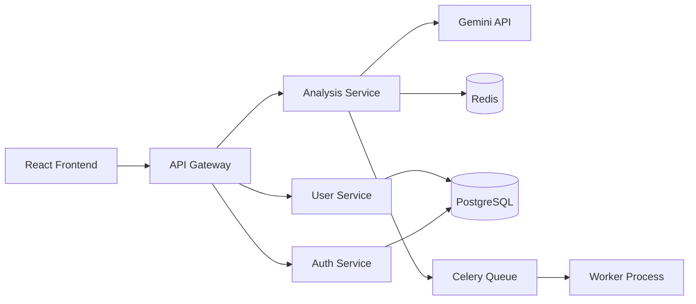
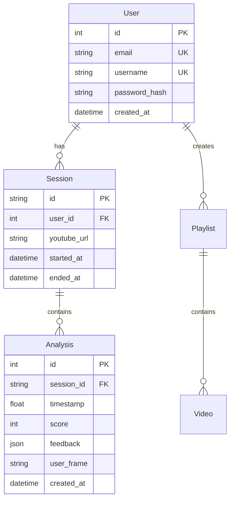

# バックエンド実装計画書

## 1. 概要

AI Studioで生成されたMVPは優れた実装ですが、プロダクション環境では以下の課題があります：

### MVPの制限
- **セキュリティリスク**: Gemini APIキーがクライアント側に露出
- **スケーラビリティ**: 直接API呼び出しによる制限
- **データ永続性**: ユーザーデータが保存されない
- **分析機能不足**: 集計・レポート機能なし

### バックエンド実装の目的
1. APIキーの安全な管理
2. レート制限とキャッシング
3. ユーザー管理と認証
4. データ分析とレポート機能

## 2. アーキテクチャ設計

### 2.1 技術スタック

```python
# 主要フレームワーク
FastAPI         # 高速なWeb API
SQLAlchemy      # ORM
PostgreSQL      # データベース
Redis           # キャッシング
Celery          # 非同期タスク
JWT             # 認証トークン
```

### 2.2 システム構成



## 3. API設計

### 3.1 認証エンドポイント

```python
from fastapi import APIRouter, Depends, HTTPException
from fastapi.security import OAuth2PasswordBearer
from pydantic import BaseModel
from typing import Optional
import jwt

router = APIRouter(prefix="/api/v1/auth")

class LoginRequest(BaseModel):
    email: str
    password: str

class TokenResponse(BaseModel):
    access_token: str
    refresh_token: str
    token_type: str = "bearer"

@router.post("/login", response_model=TokenResponse)
async def login(request: LoginRequest):
    """ユーザーログイン"""
    # 実装
    pass

@router.post("/refresh", response_model=TokenResponse)
async def refresh_token(refresh_token: str):
    """トークンリフレッシュ"""
    pass

@router.post("/logout")
async def logout(token: str = Depends(oauth2_scheme)):
    """ログアウト"""
    pass
```

### 3.2 分析エンドポイント

```python
from fastapi import APIRouter, BackgroundTasks
from pydantic import BaseModel
from typing import List, Optional
from datetime import datetime

router = APIRouter(prefix="/api/v1/analysis")

class AnalysisRequest(BaseModel):
    youtube_url: str
    timestamp: float
    user_frame: str  # Base64
    keypoints: Optional[List[dict]] = None

class AnalysisResponse(BaseModel):
    session_id: str
    score: int
    good_points: List[str]
    improvements: List[str]
    advice: str
    created_at: datetime

@router.post("/start", response_model=AnalysisResponse)
async def start_analysis(
    request: AnalysisRequest,
    background_tasks: BackgroundTasks,
    current_user: User = Depends(get_current_user)
):
    """分析開始"""
    # キャッシュチェック
    cache_key = f"{request.youtube_url}:{request.timestamp}"
    cached = await redis_client.get(cache_key)
    
    if cached:
        return AnalysisResponse(**cached)
    
    # Gemini API呼び出し（非同期）
    background_tasks.add_task(
        analyze_with_gemini,
        request,
        current_user.id
    )
    
    return AnalysisResponse(
        session_id=generate_session_id(),
        status="processing"
    )

@router.get("/history")
async def get_history(
    current_user: User = Depends(get_current_user),
    limit: int = 10,
    offset: int = 0
):
    """分析履歴取得"""
    pass
```

### 3.3 ユーザー管理

```python
from sqlalchemy import Column, Integer, String, DateTime
from sqlalchemy.ext.declarative import declarative_base
from datetime import datetime

Base = declarative_base()

class User(Base):
    __tablename__ = "users"
    
    id = Column(Integer, primary_key=True)
    email = Column(String, unique=True, index=True)
    username = Column(String, unique=True)
    hashed_password = Column(String)
    created_at = Column(DateTime, default=datetime.utcnow)
    updated_at = Column(DateTime, onupdate=datetime.utcnow)

class Session(Base):
    __tablename__ = "sessions"
    
    id = Column(String, primary_key=True)
    user_id = Column(Integer, ForeignKey("users.id"))
    youtube_url = Column(String)
    timestamp = Column(Float)
    score = Column(Integer)
    feedback = Column(JSON)
    created_at = Column(DateTime, default=datetime.utcnow)
```

## 4. セキュリティ実装

### 4.1 APIキー管理

```python
from pydantic import BaseSettings

class Settings(BaseSettings):
    # 環境変数から読み込み
    gemini_api_key: str
    database_url: str
    redis_url: str
    secret_key: str
    
    class Config:
        env_file = ".env"

settings = Settings()

# Gemini API呼び出し
async def call_gemini_api(prompt: str, image: str):
    """サーバー側でGemini APIを呼び出し"""
    genai.configure(api_key=settings.gemini_api_key)
    model = genai.GenerativeModel('gemini-1.5-flash')
    
    result = await model.generate_content_async([
        prompt,
        {"mime_type": "image/jpeg", "data": image}
    ])
    
    return result.text
```

### 4.2 レート制限

```python
from slowapi import Limiter, _rate_limit_exceeded_handler
from slowapi.util import get_remote_address

limiter = Limiter(
    key_func=get_remote_address,
    default_limits=["100 per minute"]
)

app.state.limiter = limiter
app.add_exception_handler(RateLimitExceeded, _rate_limit_exceeded_handler)

@router.post("/analysis/start")
@limiter.limit("10 per minute")
async def start_analysis(...):
    pass
```

## 5. キャッシング戦略

```python
import redis.asyncio as redis
import json
from typing import Optional

class CacheService:
    def __init__(self, redis_url: str):
        self.redis = redis.from_url(redis_url)
    
    async def get_analysis(
        self,
        youtube_url: str,
        timestamp: float,
        tolerance: float = 1.0
    ) -> Optional[dict]:
        """類似タイムスタンプの分析結果を取得"""
        pattern = f"analysis:{youtube_url}:*"
        keys = await self.redis.keys(pattern)
        
        for key in keys:
            cached_timestamp = float(key.split(":")[-1])
            if abs(cached_timestamp - timestamp) <= tolerance:
                data = await self.redis.get(key)
                return json.loads(data)
        
        return None
    
    async def set_analysis(
        self,
        youtube_url: str,
        timestamp: float,
        result: dict,
        ttl: int = 3600
    ):
        """分析結果をキャッシュ"""
        key = f"analysis:{youtube_url}:{timestamp}"
        await self.redis.setex(
            key,
            ttl,
            json.dumps(result)
        )
```

## 6. 非同期処理

```python
from celery import Celery
from typing import Dict

celery_app = Celery(
    "dance_analyzer",
    broker=settings.redis_url,
    backend=settings.redis_url
)

@celery_app.task
def analyze_dance_task(
    youtube_url: str,
    timestamp: float,
    user_frame: str,
    user_id: int
) -> Dict:
    """非同期でダンス分析を実行"""
    # Gemini API呼び出し
    result = call_gemini_api(
        build_prompt(youtube_url, timestamp),
        user_frame
    )
    
    # 結果を解析
    parsed = parse_gemini_response(result)
    
    # DBに保存
    save_to_database(user_id, parsed)
    
    # キャッシュに保存
    cache_result(youtube_url, timestamp, parsed)
    
    return parsed
```

## 7. データベース設計

### 7.1 ERD



## 8. デプロイメント

### 8.1 Docker構成

```dockerfile
# backend/Dockerfile
FROM python:3.11-slim

WORKDIR /app

COPY requirements.txt .
RUN pip install --no-cache-dir -r requirements.txt

COPY . .

CMD ["uvicorn", "app.main:app", "--host", "0.0.0.0", "--port", "8000"]
```

### 8.2 docker-compose.yml

```yaml
version: '3.8'

services:
  backend:
    build: ./backend
    ports:
      - "8000:8000"
    environment:
      - DATABASE_URL=postgresql://user:pass@db:5432/dance_analyzer
      - REDIS_URL=redis://redis:6379
      - GEMINI_API_KEY=${GEMINI_API_KEY}
    depends_on:
      - db
      - redis
  
  frontend:
    build: ./frontend
    ports:
      - "3000:3000"
    environment:
      - VITE_API_URL=http://localhost:8000
  
  db:
    image: postgres:15
    environment:
      - POSTGRES_DB=dance_analyzer
      - POSTGRES_USER=user
      - POSTGRES_PASSWORD=pass
    volumes:
      - postgres_data:/var/lib/postgresql/data
  
  redis:
    image: redis:7-alpine
    ports:
      - "6379:6379"

volumes:
  postgres_data:
```

## 9. 実装スケジュール

### Week 1-2: 基盤構築
- [ ] FastAPIプロジェクト設定
- [ ] データベース設計・マイグレーション
- [ ] 認証システム実装
- [ ] 基本的なCRUD API

### Week 3-4: コア機能
- [ ] Gemini API統合（サーバー側）
- [ ] キャッシングシステム
- [ ] 非同期タスク処理
- [ ] WebSocket通信

### Week 5-6: 最適化
- [ ] パフォーマンステスト
- [ ] セキュリティ監査
- [ ] ドキュメント整備
- [ ] デプロイメント準備

## 10. テスト戦略

```python
# tests/test_analysis.py
import pytest
from fastapi.testclient import TestClient
from app.main import app

client = TestClient(app)

@pytest.mark.asyncio
async def test_analysis_endpoint():
    """分析エンドポイントのテスト"""
    response = client.post(
        "/api/v1/analysis/start",
        json={
            "youtube_url": "https://youtube.com/watch?v=test",
            "timestamp": 10.5,
            "user_frame": "base64_encoded_image"
        },
        headers={"Authorization": "Bearer test_token"}
    )
    
    assert response.status_code == 200
    data = response.json()
    assert "session_id" in data
    assert "score" in data
```

## まとめ

このバックエンド実装により、MVPから本格的なプロダクションシステムへと進化させることができます。主な改善点：

1. **セキュリティ**: APIキーの保護、認証・認可
2. **スケーラビリティ**: キャッシング、非同期処理
3. **データ永続性**: PostgreSQLによる履歴管理
4. **分析機能**: ダッシュボード、レポート生成

これにより、エンタープライズレベルのダンス学習プラットフォームとして展開可能になります。
